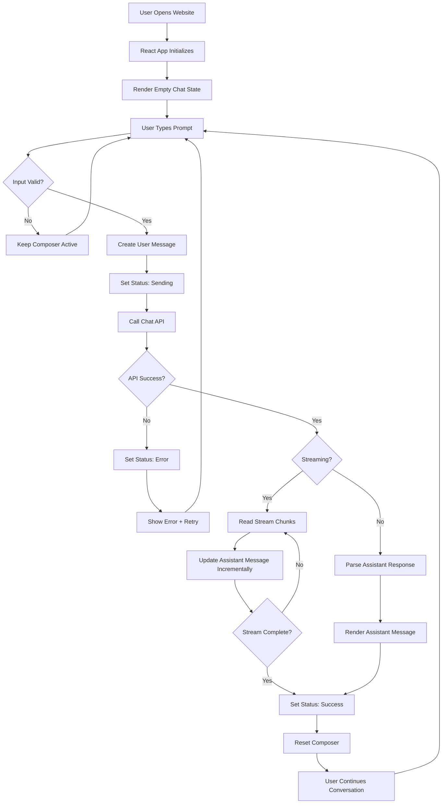

# PRD — AI Chatbot Frontend UI

> **Status:** Draft  
> **Target:** React + Vite + Tailwind CSS v4  
> **Primary goal:** Membangun frontend UI AI chatbot yang mengikuti desain HTML referensi, kemudian menghubungkannya ke API milik tim backend/AI untuk mengirim prompt dan menerima respons secara dinamis.

---

## 1. Product Overview

Produk ini adalah **web-based AI chatbot interface** dengan fokus pada pengalaman chat yang minimal, modern, dan immersive.

Desain visual menggunakan konsep **deep-ocean / glassmorphism**, dengan karakter utama:

- Background radial gradient bernuansa biru gelap → cyan.
- Ambient glow/refraction effect.
- Chat input dengan frosted glass, blur, border transparan, dan inset highlight.
- Tombol aksi berbentuk pill/circle.
- Identitas assistant melalui avatar/logo dan greeting.
- Layout responsif untuk desktop dan mobile.
- Area History pada header.
- Integrasi API sebagai sumber data percakapan dan respons AI.

Implementasi frontend harus menggunakan React dan Vite serta memigrasikan styling HTML referensi ke **Tailwind CSS v4**. Referensi HTML saat ini masih menggunakan konfigurasi Tailwind via CDN dan Tailwind v3, sehingga implementasi production perlu dipindahkan ke pipeline build React/Tailwind v4. fileciteturn0file0L5-L16

---

## 2. Product Goals

### Primary Goals

1. Membuat UI chatbot yang secara visual konsisten dengan desain HTML referensi.
2. Menjadikan UI sepenuhnya component-based dengan React.
3. Menggunakan Tailwind CSS v4 untuk styling.
4. Menyediakan chat input yang dapat:
   - mengetik prompt,
   - mengirim dengan tombol Send,
   - mengirim dengan `Enter`,
   - membuat baris baru dengan `Shift + Enter`,
   - auto-grow sesuai isi.
5. Menghubungkan frontend ke API yang disediakan tim backend/AI.
6. Menampilkan state percakapan secara real-time/async:
   - idle,
   - sending,
   - streaming/loading,
   - success,
   - error.
7. Menyediakan struktur frontend yang mudah dikembangkan untuk fitur lanjutan seperti attachment, web search, deep search, voice, dan history.

### Non-Goals untuk MVP

- Membuat model AI sendiri.
- Membuat backend/API AI.
- Membuat authentication kompleks kecuali diwajibkan oleh API.
- Membuat sistem billing/subscription.
- Membuat admin dashboard.
- Membuat voice assistant penuh.
- Menentukan format internal/model AI di sisi backend.

---

## 3. Reference Design → Frontend Requirements

HTML referensi mendefinisikan layout utama berupa header minimal, greeting assistant, chat input glassmorphism, helper shortcut, dan footer. fileciteturn0file0L85-L116

### Visual direction

**Background**

- Full viewport.
- Radial gradient dengan nuansa:
  - cyan / sky blue,
  - deep blue,
  - navy.
- Ambient glow sebagai overlay non-interactive.
- Horizontal overflow harus dicegah.

Referensi menggunakan background radial gradient dan ambient glow untuk membangun visual depth. fileciteturn0file0L31-L44

**Typography**

- Primary font: Inter/system sans.
- Heading:
  - bold,
  - tight tracking,
  - white.
- Supporting text:
  - soft cyan/white opacity.

**Glassmorphism**

Chat container harus mempertahankan karakter:

- translucent white layer,
- `backdrop-filter: blur`,
- saturation,
- translucent border,
- soft shadow,
- subtle inset highlight.

Karakter ini berasal langsung dari `.frosted-glass` pada referensi. fileciteturn0file0L45-L53

**Interactive controls**

- Pill buttons: translucent glass surface.
- Circle buttons: translucent circular controls.
- Hover dan focus state harus tetap subtle.
- Send button menggunakan aksen hijau.

Referensi menyediakan styling pill dan circular controls serta green send action. fileciteturn0file0L55-L78 fileciteturn0file0L141-L155

---

# 4. Target User Flow

## 4.1 Initial State

1. User membuka website.
2. Frontend melakukan initialization.
3. UI menampilkan:
   - Header,
   - assistant avatar,
   - greeting,
   - chat composer,
   - keyboard shortcut hint,
   - footer.
4. Chat input berada pada state `idle`.

## 4.2 Send Prompt

1. User mengetik prompt.
2. Textarea melakukan auto-grow.
3. User dapat menekan:
   - `Enter` untuk mengirim,
   - `Shift + Enter` untuk newline,
   - tombol Send untuk mengirim.
4. Frontend melakukan validation.
5. Prompt dikirim ke API.
6. Composer masuk state `loading/sending`.
7. User message ditambahkan ke conversation state.
8. Frontend menunggu respons API.
9. Respons AI ditampilkan di chat history.
10. Composer kembali ke `idle`.

Referensi HTML juga sudah menetapkan perilaku `Enter` sebagai submit dan `Shift + Enter` sebagai newline. fileciteturn0file0L181-L205

## 4.3 API Error

Jika request gagal:

1. Frontend menampilkan error state.
2. User prompt tetap dipertahankan pada conversation state.
3. UI menyediakan mekanisme retry.
4. Composer kembali dapat digunakan setelah request selesai.

## 4.4 History

Header memiliki tombol **History** pada desain referensi. fileciteturn0file0L85-L95

MVP dapat menggunakan tombol tersebut sebagai entry point ke history drawer/page/modal.

Implementasi history belum ditentukan pada HTML, sehingga detail penyimpanan dan API history harus disepakati dengan tim backend sebelum development fitur tersebut.

---

# 5. Core Functional Requirements

## FR-01 — Chat Composer

Frontend MUST menyediakan composer utama yang:

- menggunakan textarea,
- mendukung multiline,
- auto-grow,
- memiliki placeholder `Ask anything...`,
- disabled saat request tertentu jika diperlukan,
- memiliki tombol Send,
- mendukung keyboard shortcut.

Referensi menggunakan textarea dengan `rows="2"` dan minimum height sekitar 52px. fileciteturn0file0L118-L125

### Acceptance Criteria

- Prompt kosong tidak dapat dikirim.
- Whitespace-only prompt tidak dapat dikirim.
- Enter mengirim prompt.
- Shift + Enter membuat newline.
- Composer kembali ke tinggi minimum setelah submit.
- Textarea tetap usable pada mobile.

---

## FR-02 — Send Message

Saat user mengirim prompt:

```text
User input
   ↓
Validate
   ↓
Create user message
   ↓
POST/Request API
   ↓
Loading state
   ↓
Receive AI response
   ↓
Create assistant message
   ↓
Render conversation
```

### Minimum message model

```ts
type ChatMessage = {
  id: string
  role: "user" | "assistant"
  content: string
  createdAt: string
  status?: "sending" | "success" | "error"
}
```

Model ini merupakan kontrak frontend awal. Field tambahan dapat disesuaikan dengan API tim backend.

---

## FR-03 — API Integration

Frontend harus mempunyai satu abstraction layer khusus untuk API, sehingga component UI tidak melakukan `fetch()` langsung.

Recommended structure:

```text
src/
├─ api/
│  └─ chatApi.ts
├─ components/
├─ hooks/
├─ pages/
├─ types/
├─ utils/
└─ App.tsx
```

### API abstraction responsibilities

`chatApi.ts` bertanggung jawab untuk:

- membuat request,
- serialisasi payload,
- parsing response,
- menangani HTTP error,
- timeout/cancellation,
- normalisasi data API menjadi model frontend.

### Important

Endpoint, authentication mechanism, request body, response body, streaming protocol, dan error schema **harus mengikuti kontrak dari tim backend**.

Contoh endpoint berikut hanya bersifat ilustrasi, bukan endpoint final:

```http
POST /api/chat
```

Contoh payload:

```json
{
  "message": "Hello AI",
  "conversationId": "optional-id"
}
```

Contoh response:

```json
{
  "conversationId": "abc123",
  "message": {
    "role": "assistant",
    "content": "Hello! How can I help you?"
  }
}
```

---

## FR-04 — Conversation UI

Frontend harus mendukung tampilan:

### Empty State

Menampilkan:

- avatar/logo assistant,
- `Hi, I'm Oxigen.`,
- `How can I help you today?`,
- composer.

Referensi menggunakan greeting tersebut secara eksplisit. fileciteturn0file0L99-L116

### Active Chat State

Ketika conversation dimulai:

- greeting dapat digantikan/berpindah ke chat transcript,
- user message ditampilkan,
- assistant response ditampilkan,
- composer tetap tersedia.

### Loading State

Saat menunggu API:

- tampilkan visual loading/typing,
- disable aksi yang berpotensi double-submit,
- tetap memungkinkan cancellation bila API mendukungnya.

---

# 6. Secondary Features / Progressive Enhancement

Feature berikut sudah direpresentasikan atau diindikasikan oleh desain referensi, namun sebagian belum mempunyai behavior final sehingga masuk tahap lanjutan.

## 6.1 Attachment

Desain menyediakan tombol attachment clip. fileciteturn0file0L126-L135

MVP:

- tombol dapat tersedia secara UI,
- behavior dapat disabled/feature-flagged sampai API file upload tersedia.

Future:

```text
Select file
→ validate file
→ upload
→ receive fileId/url
→ attach to chat request
```

## 6.2 Deep Search

HTML referensi memiliki area untuk **Deep Search** pada action bar, tetapi implementasi behavior/API belum tersedia pada source. fileciteturn0file0L126-L140

Requirement:

- UI boleh disiapkan sebagai feature flag.
- Request harus membawa mode pencarian jika backend mendukungnya.

Contoh:

```ts
type ChatMode = "standard" | "deep-search" | "web-search"
```

## 6.3 Web Search

Sama seperti Deep Search, area action bar dapat menjadi placeholder untuk integrasi search tool. Behavior final harus mengikuti API backend.

## 6.4 Voice

Desain menyediakan circular voice/audio button. fileciteturn0file0L141-L148

MVP:

- UI button dapat ditampilkan.
- Voice functionality belum menjadi acceptance criteria MVP.

Future:

```text
Microphone
→ Speech-to-Text
→ Composer
→ Send
```

## 6.5 History

History button tersedia di header. fileciteturn0file0L85-L95

Future behavior:

```text
History
→ Open History Drawer
→ Select Conversation
→ Load Conversation
```

---

# 7. UI Component Architecture

Recommended React component tree:

```text
App
├── AppShell
│   ├── Header
│   │   └── HistoryButton
│   │
│   ├── Main
│   │   ├── AssistantGreeting
│   │   │   ├── AssistantAvatar
│   │   │   ├── GreetingTitle
│   │   │   └── GreetingSubtitle
│   │   │
│   │   ├── ChatConversation
│   │   │   ├── UserMessage
│   │   │   ├── AssistantMessage
│   │   │   └── TypingIndicator
│   │   │
│   │   └── ChatComposer
│   │       ├── PromptTextarea
│   │       ├── AttachmentButton
│   │       ├── DeepSearchButton
│   │       ├── WebSearchButton
│   │       ├── VoiceButton
│   │       └── SendButton
│   │
│   └── Footer
```

### Suggested responsibility split

| Component | Responsibility |
|---|---|
| `AppShell` | Layout global |
| `Header` | Branding + History |
| `AssistantGreeting` | Empty-state identity |
| `ChatConversation` | Message rendering |
| `ChatMessage` | Individual message |
| `ChatComposer` | Input + controls |
| `PromptTextarea` | Input + keyboard behavior |
| `TypingIndicator` | Loading state |
| `HistoryDrawer` | Conversation history |
| `Footer` | Credit/footer UI |

---

# 8. State Management

MVP tidak membutuhkan global state library apabila state masih kecil.

Recommended:

```text
React state
   +
useChat() custom hook
   +
chatApi abstraction
```

Example:

```ts
type ChatStatus =
  | "idle"
  | "sending"
  | "streaming"
  | "success"
  | "error"
```

### Recommended `useChat()` responsibilities

- `messages`
- `status`
- `error`
- `sendMessage()`
- `retryMessage()`
- `clearConversation()`

---

# 9. Tailwind CSS v4 Migration Requirements

HTML referensi menggunakan Tailwind CDN + JavaScript configuration. fileciteturn0file0L5-L10

Production implementation harus menggunakan Tailwind CSS v4 melalui build tooling Vite.

### Migration principles

1. Jangan mempertahankan `tailwind.config.js` lama hanya untuk menyalin konfigurasi visual.
2. Gunakan CSS-first configuration Tailwind v4.
3. Gunakan `@theme` untuk design tokens yang relevan.
4. Gunakan arbitrary values hanya untuk nilai yang benar-benar spesifik.
5. Custom CSS tetap boleh digunakan untuk efek yang lebih tepat seperti:
   - radial background,
   - backdrop filter,
   - ambient glow.
6. Hindari inline JavaScript DOM manipulation seperti `document.getElementById()` karena behavior harus dipindahkan ke React state/event.

### Design tokens dari reference

Reference mendefinisikan:

```text
brand.cyan       #00D2FF
brand.deepBlue   #001A4D
brand.greenSubmit #4ADE80
```

serta font stack berbasis Inter/system sans dan shadow glass/glow. fileciteturn0file0L9-L28

Token tersebut menjadi basis design system frontend.

---

# 10. Icon System

Stack membutuhkan icon library.

**Recommended:** `lucide-react`

Alasan:

- React-native component approach.
- Icon dapat diberi class Tailwind.
- Stroke style cocok dengan desain interface minimal/glass.
- Tidak perlu menulis SVG manual untuk setiap button.

Icon mapping awal:

| UI | Icon |
|---|---|
| Attachment | `Paperclip` |
| Deep Search | `ScanSearch` / `Search` |
| Web Search | `Globe` |
| Voice | `AudioWaveform` / `Mic` |
| Send | `ArrowUp` |
| History | `History` |
| Close | `X` |
| Retry | `RotateCcw` |

Icon final dapat disesuaikan dengan visual QA.

---

# 11. ASCII Wireframe

## 11.1 Desktop — Empty State

```text
┌──────────────────────────────────────────────────────────────────────┐
│                                                                      │
│  [ BRAND / LOGO ]                                      [ History ]  │
│                                                                      │
│                                                                      │
│                         ┌──────────────┐                             │
│                         │              │                             │
│                         │  AI AVATAR   │                             │
│                         │              │                             │
│                         └──────────────┘                             │
│                                                                      │
│                       Hi, I'm Oxigen.                                │
│                    How can I help you today?                          │
│                                                                      │
│                ┌──────────────────────────────────────┐              │
│                │ Ask anything...                       │              │
│                │                                      │              │
│                │  (📎)  [Deep Search] [Web Search]   │              │
│                │                         (◫)    (↑)   │              │
│                └──────────────────────────────────────┘              │
│                                                                      │
│                    Enter → send   Shift+Enter → newline              │
│                                                                      │
│                         ICONS & INTERFACE BY                          │
│                              OXIGEN.COM                               │
│                                                                      │
└──────────────────────────────────────────────────────────────────────┘
```

> `Deep Search` dan `Web Search` ditampilkan sebagai konsep layout/feature extension karena source HTML menyediakan area tersebut tetapi belum mendefinisikan implementasi button secara lengkap. fileciteturn0file0L126-L140

---

## 11.2 Desktop — Active Chat

```text
┌──────────────────────────────────────────────────────────────────────┐
│                                                                      │
│  [ BRAND ]                                              [ History ] │
│                                                                      │
│     ┌────────────────────────────────────────────────────────────┐   │
│     │ User                                                       │   │
│     │ Tolong jelaskan apa itu React                              │   │
│     └────────────────────────────────────────────────────────────┘   │
│                                                                      │
│  ┌──────────────────────────────────────────────────────────────┐    │
│  │ AI                                                           │    │
│  │ React adalah library JavaScript untuk membangun UI...        │    │
│  └──────────────────────────────────────────────────────────────┘    │
│                                                                      │
│                                                                      │
│             ┌──────────────────────────────────────┐                 │
│             │ Ask anything...                       │                 │
│             │                                      │                 │
│             │ (📎)   [Search]              (◫) (↑)│                 │
│             └──────────────────────────────────────┘                 │
│                                                                      │
└──────────────────────────────────────────────────────────────────────┘
```

---

## 11.3 Mobile

```text
┌───────────────────────────────┐
│                               │
│  [LOGO]              [⋯]     │
│                               │
│       ┌─────────────┐         │
│       │   AVATAR    │         │
│       └─────────────┘         │
│                               │
│      Hi, I'm Oxigen.          │
│  How can I help you today?    │
│                               │
│  ┌─────────────────────────┐  │
│  │ Ask anything...          │  │
│  │                         │  │
│  │ (📎) (Search)      (↑)  │  │
│  └─────────────────────────┘  │
│                               │
│     Enter → send              │
│     Shift + Enter → newline   │
│                               │
│       OXIGEN.COM              │
│                               │
└───────────────────────────────┘
```

---

# 12. Mermaid Flow Chart



---

# 13. Detailed Workflow

## Workflow A — User Sends Message

```text
[Idle]
   │
   ▼
[User types prompt]
   │
   ▼
[Textarea auto-grow]
   │
   ▼
[Enter / Send clicked]
   │
   ▼
[Validate prompt]
   │
   ├── empty ──→ [Do nothing]
   │
   ▼
[Append UserMessage]
   │
   ▼
[API request]
   │
   ▼
[Loading / Streaming]
   │
   ├── error ──→ [Error UI] → [Retry]
   │
   ▼
[Assistant response]
   │
   ▼
[Append AssistantMessage]
   │
   ▼
[Composer reset]
   │
   ▼
[Idle]
```

## Workflow B — Conversation History

```text
[History Button]
      │
      ▼
[Open Drawer / Page]
      │
      ▼
[Request Conversation List]
      │
      ▼
[Render Conversations]
      │
      ▼
[User Selects Conversation]
      │
      ▼
[Request Messages]
      │
      ▼
[Render Existing Chat]
```

## Workflow C — Attachment (Future)

```text
[Attachment Button]
       │
       ▼
[File Picker]
       │
       ▼
[Validate File]
       │
       ├── invalid → [Show Error]
       │
       ▼
[Upload API]
       │
       ▼
[Receive File Reference]
       │
       ▼
[Attach to Message]
       │
       ▼
[Send Chat Request]
```

---

# 14. API Integration Contract

Backend team perlu menyediakan dokumen API yang sekurang-kurangnya mendefinisikan:

| Contract | Required |
|---|---|
| Base URL | Yes |
| Chat endpoint | Yes |
| HTTP method | Yes |
| Request payload | Yes |
| Response payload | Yes |
| Conversation ID | Recommended |
| Authentication | Depends on backend |
| Streaming protocol | Optional / Recommended |
| Error format | Yes |
| Rate limit behavior | Recommended |
| CORS policy | Yes |
| File upload contract | Future |

### Frontend adapter

Frontend sebaiknya mengubah response API menjadi format internal:

```ts
type ChatResponse = {
  conversationId?: string
  message: {
    id?: string
    role: "assistant"
    content: string
    createdAt?: string
  }
}
```

Backend boleh mempunyai format yang berbeda selama adapter frontend dapat menormalisasikannya.

---

# 15. Error Handling

Minimal error scenarios:

### Network Error

```text
"Unable to connect to the server."
```

### API 4xx

```text
"Your request could not be processed."
```

### API 5xx

```text
"The AI service is temporarily unavailable."
```

### Timeout

```text
"The request took too long. Please try again."
```

### Empty API Response

```text
"No response was returned. Please try again."
```

Error message final sebaiknya tidak membocorkan stack trace, secret, token, atau detail internal server.

---

# 16. Loading / Streaming UX

MVP harus memiliki feedback yang jelas ketika request sedang diproses.

Recommended:

```text
User message
      ↓
Assistant bubble appears
      ↓
Typing indicator / streaming text
      ↓
Final response
```

Apabila backend mendukung streaming:

- frontend membaca stream secara incremental,
- assistant message diperbarui tanpa membuat bubble baru untuk setiap chunk,
- user dapat melihat respons muncul secara progresif.

---

# 17. Responsive Requirements

### Desktop

- Content centered.
- Composer memiliki max-width.
- Header memiliki horizontal padding lebih besar.
- Message transcript memiliki readable max-width.

### Tablet

- Padding diperkecil secara proporsional.
- Action buttons tetap dapat digunakan.

### Mobile

- Composer width mendekati full width.
- Button sizes tetap touch-friendly.
- Action items dapat wrap.
- Textarea tidak keluar viewport.
- Header tidak menyebabkan horizontal overflow.

Referensi HTML memang membedakan spacing dan ukuran element antara mobile (`sm:`) dan desktop. fileciteturn0file0L98-L124

---

# 18. Accessibility

Minimum requirement:

- Semua icon-only button memiliki `aria-label`.
- Interactive controls dapat diakses via keyboard.
- Focus state terlihat.
- Contrast text harus tetap terbaca.
- Textarea memiliki accessible label/description.
- Loading state diumumkan secara semantik bila diperlukan.
- Error message menggunakan `role="alert"` atau mekanisme aksesibilitas setara.

Referensi sudah menggunakan `aria-label` pada attachment, voice, dan send button; pola ini harus dipertahankan pada React implementation. fileciteturn0file0L130-L150

---

# 19. Performance Requirements

- Vite production build harus digunakan.
- Jangan melakukan unnecessary API request.
- Jangan membuat duplicate submit ketika user menekan Enter dan Send bersamaan.
- Lazy-load feature yang berat jika diperlukan.
- Hindari re-render seluruh conversation ketika hanya satu message berubah.
- Gunakan stable `key` untuk list messages.
- Streaming response harus diproses secara efisien.

---

# 20. Security Requirements

Frontend:

- Jangan hardcode API secret/key yang bersifat private.
- API key secret tidak boleh disimpan di client bundle.
- Gunakan environment variable hanya untuk **public configuration**.
- Authentication token harus ditangani sesuai mekanisme backend.
- Jangan menampilkan raw API errors ke user.
- Sanitasi/render markdown dengan library yang aman apabila assistant response mendukung Markdown/HTML.
- Hindari `dangerouslySetInnerHTML` kecuali input sudah disanitasi.

---

# 21. Suggested Tech Stack

## Core

```text
React
Vite
TypeScript
Tailwind CSS v4
```

## Icons

```text
lucide-react
```

## Optional

```text
react-markdown
```

Untuk rendering response AI dalam Markdown, apabila backend mengembalikan Markdown.

### Recommended installation direction

```bash
npm create vite@latest ai-chatbot-frontend -- --template react-ts
npm install
npm install lucide-react
npm install tailwindcss @tailwindcss/vite
```

Command final harus mengikuti versi package yang digunakan pada saat development.

---

# 22. Environment Variables

Example:

```env
VITE_API_BASE_URL=https://api.example.com
```

Rules:

- Hanya public configuration yang menggunakan `VITE_`.
- Secret/API private key tidak boleh berada di `.env` frontend yang akan dibundle ke browser.

---

# 23. Definition of Done — MVP

MVP dianggap selesai apabila:

- [ ] React + Vite project berjalan.
- [ ] Tailwind CSS v4 terintegrasi.
- [ ] UI mengikuti desain referensi.
- [ ] Responsive desktop/mobile.
- [ ] Background + glassmorphism sesuai visual target.
- [ ] Assistant greeting tampil.
- [ ] Chat textarea tersedia.
- [ ] Auto-grow berjalan.
- [ ] Enter mengirim.
- [ ] Shift + Enter membuat newline.
- [ ] Send button bekerja.
- [ ] API layer terpisah dari UI.
- [ ] User message tampil.
- [ ] Assistant response tampil.
- [ ] Loading state tersedia.
- [ ] Error state tersedia.
- [ ] Retry tersedia.
- [ ] Tidak ada API secret di browser.
- [ ] Icon system menggunakan library.
- [ ] Accessible labels untuk icon-only actions.
- [ ] Production build berhasil tanpa error.

---

# 24. Acceptance Test Scenario

## Scenario 1 — Send by Button

**Given:** User berada pada empty chat.  
**When:** User memasukkan `"Hello AI"` kemudian menekan Send.  
**Then:**

- User message muncul.
- Loading state muncul.
- API request terkirim satu kali.
- Assistant response muncul.
- Composer kembali kosong.

## Scenario 2 — Send by Enter

**Given:** User mengetik prompt.  
**When:** User menekan Enter.  
**Then:** Prompt dikirim.

## Scenario 3 — New Line

**Given:** User mengetik prompt.  
**When:** User menekan Shift + Enter.  
**Then:** Cursor berpindah ke baris baru dan request tidak dikirim.

## Scenario 4 — API Failure

**Given:** API unavailable.  
**When:** User mengirim prompt.  
**Then:**

- Loading berhenti.
- Error state ditampilkan.
- User dapat retry.
- Tidak ada crash pada UI.

## Scenario 5 — Mobile

**Given:** Viewport mobile.  
**When:** User membuka dan mengirim prompt.  
**Then:**

- Tidak ada horizontal overflow.
- Composer tetap usable.
- Tombol utama dapat disentuh.
- Conversation tetap terbaca.

---

# 25. Suggested Project Structure

```text
ai-chatbot-frontend/
├─ public/
│  └─ assets/
│
├─ src/
│  ├─ api/
│  │  └─ chatApi.ts
│  │
│  ├─ components/
│  │  ├─ layout/
│  │  │  ├─ AppShell.tsx
│  │  │  ├─ Header.tsx
│  │  │  └─ Footer.tsx
│  │  │
│  │  ├─ chat/
│  │  │  ├─ ChatConversation.tsx
│  │  │  ├─ ChatMessage.tsx
│  │  │  ├─ ChatComposer.tsx
│  │  │  ├─ PromptTextarea.tsx
│  │  │  └─ TypingIndicator.tsx
│  │  │
│  │  └─ common/
│  │     └─ IconButton.tsx
│  │
│  ├─ hooks/
│  │  └─ useChat.ts
│  │
│  ├─ pages/
│  │  └─ ChatPage.tsx
│  │
│  ├─ types/
│  │  └─ chat.ts
│  │
│  ├─ lib/
│  │  └─ apiClient.ts
│  │
│  ├─ App.tsx
│  ├─ main.tsx
│  └─ index.css
│
├─ .env.example
├─ package.json
├─ vite.config.ts
└─ PRD.md
```

---

# 26. Development Phases

## Phase 1 — Foundation

- Create Vite React TypeScript project.
- Configure Tailwind CSS v4.
- Install icon library.
- Establish design tokens.
- Establish base layout.

## Phase 2 — UI Recreation

- Background.
- Ambient glow.
- Header.
- Assistant greeting.
- Glass composer.
- Action buttons.
- Footer.
- Responsive states.

## Phase 3 — Chat State

- Message model.
- Conversation state.
- Input handling.
- Enter / Shift+Enter.
- Loading state.
- Error state.

## Phase 4 — API Integration

- API client.
- Request mapping.
- Response mapping.
- Error normalization.
- Streaming support if available.

## Phase 5 — QA

- Responsive QA.
- Accessibility QA.
- API failure tests.
- Duplicate-submit tests.
- Production build.
- Performance review.

## Phase 6 — Future Features

- History.
- Attachment.
- Web Search.
- Deep Search.
- Voice.
- Authentication.

---

# 27. Open Questions for Backend Team

Sebelum API integration final, backend team perlu menjawab:

1. Apa base URL API?
2. Endpoint chat final apa?
3. Apakah API menggunakan authentication?
4. Bagaimana format request?
5. Bagaimana format response?
6. Apakah conversation memiliki `conversationId`?
7. Apakah response menggunakan streaming?
8. Jika streaming, apakah menggunakan SSE, Fetch Stream, WebSocket, atau protocol lain?
9. Bagaimana error response?
10. Apakah chat mendukung attachment?
11. Apakah tersedia endpoint history?
12. Apakah tersedia mode web search/deep search?
13. Apa batas ukuran/rate limit request?
14. Bagaimana CORS dikonfigurasi?

---

# 28. Success Metrics

Untuk MVP frontend:

- UI mampu digunakan tanpa horizontal overflow pada target viewport.
- Request chat berhasil dikirim dan response dirender.
- Tidak terjadi double-submit.
- Error API tidak menyebabkan UI crash.
- Production build sukses.
- Visual implementation memiliki konsistensi tinggi terhadap HTML reference.
- Struktur komponen dan API abstraction memungkinkan feature extension tanpa refactor besar.

---

# 29. Final Product Definition

Produk final MVP adalah:

> **Responsive AI chatbot frontend berbasis React + Vite + Tailwind CSS v4 yang mempertahankan desain deep-ocean glassmorphism dari HTML referensi, memiliki composer chat interaktif, conversation UI, state loading/error, serta API abstraction layer untuk mengonsumsi data dari backend AI milik tim.**

Frontend tidak boleh mengikat UI secara langsung pada implementasi internal backend. Semua komunikasi harus melewati abstraction/API layer agar backend dapat berkembang tanpa memaksa perubahan besar pada komponen UI.
